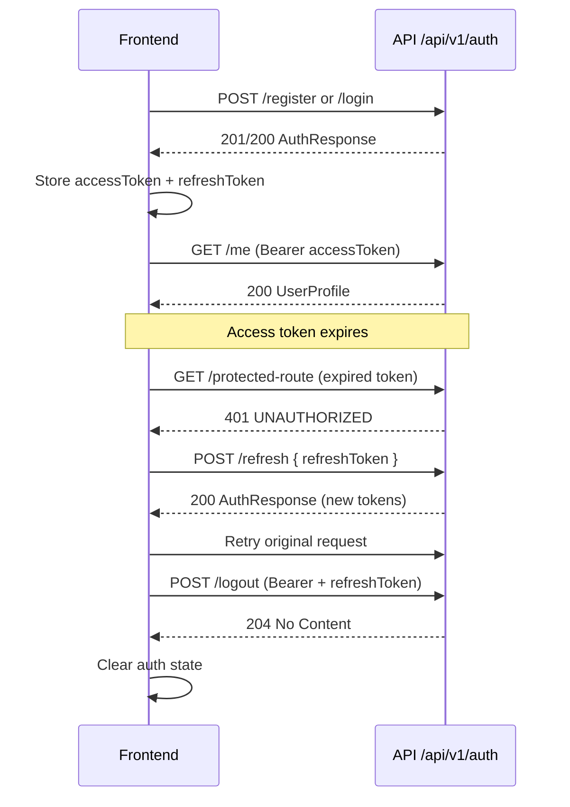

# API Contract: Auth

**Feature**: auth | **Base path**: `/api/v1/auth` | **Auth scheme**: JWT Bearer + opaque refresh token

All responses use the standard envelope — except `POST /logout`, which returns **204 No Content** with an empty body.

```json
{
  "success": true,
  "data": {},
  "meta": { "timestamp": "ISO-8601", "requestId": "uuid" },
  "error": null
}
```

---

## Authentication model

| Token         | Format                        | Lifetime (default)            | Usage                                                        |
| ------------- | ----------------------------- | ----------------------------- | ------------------------------------------------------------ |
| Access token  | JWT                           | 15 minutes (`expiresIn: 900`) | `Authorization: Bearer <accessToken>` on protected endpoints |
| Refresh token | Opaque hex string (128 chars) | 7 days                        | Sent in request body to `/refresh` and `/logout`             |

### JWT access token payload

```typescript
interface JwtPayload {
  sub: string; // user id (UUID)
  email: string;
  role: Role;
}
```

### Token rotation

Each call to `POST /auth/refresh` **revokes** the submitted refresh token and issues a **new** access + refresh pair. FE must replace stored tokens after every refresh.

### FE integration checklist

1. On register/login/refresh success, persist `tokens.accessToken`, `tokens.refreshToken`, and `tokens.expiresIn`.
2. Attach `Authorization: Bearer <accessToken>` to all protected API calls.
3. On `401 UNAUTHORIZED` from a protected endpoint, call `POST /auth/refresh` with the stored refresh token, update tokens, and retry once.
4. On refresh failure (`401`), clear auth state and redirect to login.
5. On logout, call `POST /auth/logout` with the refresh token (while access token is still valid), then clear local auth state.

---

## Shared types

```typescript
type Role = "user" | "admin";

interface UserProfile {
  id: string;
  email: string;
  displayName: string;
  role: Role;
  createdAt: string; // ISO-8601
}

interface AuthTokens {
  accessToken: string;
  refreshToken: string;
  expiresIn: number; // access token TTL in seconds
  tokenType: "Bearer";
}

interface AuthResponse {
  user: UserProfile;
  tokens: AuthTokens;
}
```

Types are exported from `@db-play/types` for shared FE/BE usage.

---

## POST /api/v1/auth/register

Create a new account. Email is normalized to lowercase before storage.

**Auth**: Public (no bearer required)

**Rate limit**: 5 requests / 60 seconds per IP

### Request body

| Field         | Type   | Validation         |
| ------------- | ------ | ------------------ |
| `email`       | string | Valid email format |
| `password`    | string | 8–72 characters    |
| `displayName` | string | 2–100 characters   |

```typescript
interface RegisterRequest {
  email: string;
  password: string;
  displayName: string;
}
```

### Response `data`

`AuthResponse` — see [Shared types](#shared-types).

### Example (201)

```json
{
  "success": true,
  "data": {
    "user": {
      "id": "a1b2c3d4-e5f6-7890-abcd-ef1234567890",
      "email": "user@example.com",
      "displayName": "John Doe",
      "role": "user",
      "createdAt": "2026-07-08T02:00:00.000Z"
    },
    "tokens": {
      "accessToken": "eyJhbGciOiJIUzI1NiIsInR5cCI6IkpXVCJ9...",
      "refreshToken": "a3f8c2d1e9b7...",
      "expiresIn": 900,
      "tokenType": "Bearer"
    }
  },
  "meta": { "timestamp": "2026-07-08T02:00:00.000Z" },
  "error": null
}
```

### Errors

| Status | Code             | When                                                                                |
| ------ | ---------------- | ----------------------------------------------------------------------------------- |
| 400    | VALIDATION_ERROR | Invalid email, password too short/long, displayName out of range, or unknown fields |
| 409    | CONFLICT         | Email already registered                                                            |
| 429    | RATE_LIMITED     | Too many registration attempts                                                      |
| 500    | INTERNAL_ERROR   | Unexpected failure                                                                  |

### Example (409)

```json
{
  "success": false,
  "data": null,
  "meta": { "timestamp": "2026-07-08T02:00:00.000Z" },
  "error": {
    "code": "CONFLICT",
    "message": "An account with this email already exists"
  }
}
```

---

## POST /api/v1/auth/login

Authenticate with email and password.

**Auth**: Public

**Rate limit**: 10 requests / 60 seconds per IP

### Request body

| Field      | Type   | Validation           |
| ---------- | ------ | -------------------- |
| `email`    | string | Valid email format   |
| `password` | string | Minimum 8 characters |

```typescript
interface LoginRequest {
  email: string;
  password: string;
}
```

### Response `data`

`AuthResponse`

### Example (200)

```json
{
  "success": true,
  "data": {
    "user": {
      "id": "a1b2c3d4-e5f6-7890-abcd-ef1234567890",
      "email": "user@example.com",
      "displayName": "John Doe",
      "role": "user",
      "createdAt": "2026-07-08T02:00:00.000Z"
    },
    "tokens": {
      "accessToken": "eyJhbGciOiJIUzI1NiIsInR5cCI6IkpXVCJ9...",
      "refreshToken": "b4e9d3c2f0a8...",
      "expiresIn": 900,
      "tokenType": "Bearer"
    }
  },
  "meta": { "timestamp": "2026-07-08T02:00:00.000Z" },
  "error": null
}
```

### Errors

| Status | Code             | When                                  |
| ------ | ---------------- | ------------------------------------- |
| 400    | VALIDATION_ERROR | Invalid email or password too short   |
| 401    | UNAUTHORIZED     | Email not found or password incorrect |
| 429    | RATE_LIMITED     | Too many login attempts               |
| 500    | INTERNAL_ERROR   | Unexpected failure                    |

### Example (401)

```json
{
  "success": false,
  "data": null,
  "meta": { "timestamp": "2026-07-08T02:00:00.000Z" },
  "error": {
    "code": "UNAUTHORIZED",
    "message": "Invalid email or password"
  }
}
```

> **Security note**: Login always returns the same error message for unknown email and wrong password. FE should not attempt to distinguish between the two.

---

## POST /api/v1/auth/refresh

Rotate tokens using a valid refresh token. The submitted refresh token is revoked; a new pair is returned.

**Auth**: Public (refresh token is sent in body, not as Bearer)

**Rate limit**: 20 requests / 60 seconds per IP

### Request body

| Field          | Type   | Validation          |
| -------------- | ------ | ------------------- |
| `refreshToken` | string | Required, non-empty |

```typescript
interface RefreshTokenRequest {
  refreshToken: string;
}
```

### Response `data`

`AuthResponse` — same shape as login/register.

### Example (200)

```json
{
  "success": true,
  "data": {
    "user": {
      "id": "a1b2c3d4-e5f6-7890-abcd-ef1234567890",
      "email": "user@example.com",
      "displayName": "John Doe",
      "role": "user",
      "createdAt": "2026-07-08T02:00:00.000Z"
    },
    "tokens": {
      "accessToken": "eyJhbGciOiJIUzI1NiIsInR5cCI6IkpXVCJ9...",
      "refreshToken": "c5f0e4d3b1a9...",
      "expiresIn": 900,
      "tokenType": "Bearer"
    }
  },
  "meta": { "timestamp": "2026-07-08T02:00:00.000Z" },
  "error": null
}
```

### Errors

| Status | Code             | When                                               |
| ------ | ---------------- | -------------------------------------------------- |
| 400    | VALIDATION_ERROR | Missing `refreshToken`                             |
| 401    | UNAUTHORIZED     | Refresh token invalid, expired, or already revoked |
| 429    | RATE_LIMITED     | Too many refresh attempts                          |
| 500    | INTERNAL_ERROR   | Unexpected failure                                 |

### Example (401)

```json
{
  "success": false,
  "data": null,
  "meta": { "timestamp": "2026-07-08T02:00:00.000Z" },
  "error": {
    "code": "UNAUTHORIZED",
    "message": "Invalid or expired refresh token"
  }
}
```

---

## POST /api/v1/auth/logout

Revoke the submitted refresh token. Idempotent — succeeds even if the token is already revoked or unknown.

**Auth**: Bearer required (`Authorization: Bearer <accessToken>`)

### Request body

| Field          | Type   | Validation          |
| -------------- | ------ | ------------------- |
| `refreshToken` | string | Required, non-empty |

```typescript
interface LogoutRequest {
  refreshToken: string;
}
```

### Response

**204 No Content** — empty body, no envelope.

### Errors

| Status | Code             | When                                      |
| ------ | ---------------- | ----------------------------------------- |
| 400    | VALIDATION_ERROR | Missing `refreshToken`                    |
| 401    | UNAUTHORIZED     | Missing, invalid, or expired access token |
| 500    | INTERNAL_ERROR   | Unexpected failure                        |

---

## GET /api/v1/auth/me

Return the authenticated user's profile.

**Auth**: Bearer required

### Response `data`

`UserProfile`

### Example (200)

```json
{
  "success": true,
  "data": {
    "id": "a1b2c3d4-e5f6-7890-abcd-ef1234567890",
    "email": "user@example.com",
    "displayName": "John Doe",
    "role": "user",
    "createdAt": "2026-07-08T02:00:00.000Z"
  },
  "meta": { "timestamp": "2026-07-08T02:00:00.000Z" },
  "error": null
}
```

### Errors

| Status | Code           | When                                      |
| ------ | -------------- | ----------------------------------------- |
| 401    | UNAUTHORIZED   | Missing, invalid, or expired access token |
| 404    | NOT_FOUND      | User referenced by token no longer exists |
| 500    | INTERNAL_ERROR | Unexpected failure                        |

### Example (401)

```json
{
  "success": false,
  "data": null,
  "meta": { "timestamp": "2026-07-08T02:00:00.000Z" },
  "error": {
    "code": "UNAUTHORIZED",
    "message": "Unauthorized"
  }
}
```

---

## Protected endpoints (global behavior)

All `/api/v1/*` routes require a valid Bearer token **unless** marked `@Public()`. Auth endpoints `register`, `login`, and `refresh` are public; `logout` and `me` require Bearer.

FE should treat any `401` on a protected route as a signal to attempt token refresh (once) before clearing session.

| Status | Code         | Typical cause                                             |
| ------ | ------------ | --------------------------------------------------------- |
| 401    | UNAUTHORIZED | No `Authorization` header, malformed Bearer, expired JWT  |
| 403    | FORBIDDEN    | Valid token but insufficient role (e.g. admin-only route) |

---

## Validation error format

When request body fails validation (`400`):

```json
{
  "success": false,
  "data": null,
  "meta": { "timestamp": "2026-07-08T02:00:00.000Z" },
  "error": {
    "code": "VALIDATION_ERROR",
    "message": "email must be an email, password must be longer than or equal to 8 characters",
    "details": {
      "message": [
        "email must be an email",
        "password must be longer than or equal to 8 characters"
      ],
      "error": "Bad Request",
      "statusCode": 400
    }
  }
}
```

Unknown fields in the request body are rejected (`forbidNonWhitelisted: true`).

---

## Suggested FE auth flow



---

## OpenAPI tags

- Tag: `auth`
- Operations: `register`, `login`, `refreshTokens`, `logout`, `getMe`

Swagger UI: `http://localhost:3001/api/docs`

---

## Integration test requirements

1. `POST /auth/register` with valid body returns `201` with `user` and `tokens`
2. `POST /auth/register` with duplicate email returns `409 CONFLICT`
3. `POST /auth/login` with valid credentials returns `200` with tokens
4. `POST /auth/login` with wrong password returns `401 UNAUTHORIZED`
5. `POST /auth/refresh` with valid refresh token returns `200` with new token pair
6. `POST /auth/refresh` with revoked/expired token returns `401 UNAUTHORIZED`
7. `GET /auth/me` with valid Bearer returns `200` with `UserProfile`
8. `GET /auth/me` without Bearer returns `401 UNAUTHORIZED`
9. `POST /auth/logout` with valid Bearer + refresh token returns `204`
10. After logout, the same refresh token cannot be used again (`401` on refresh)
